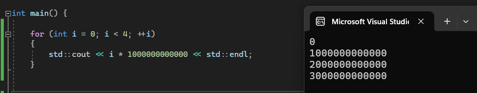
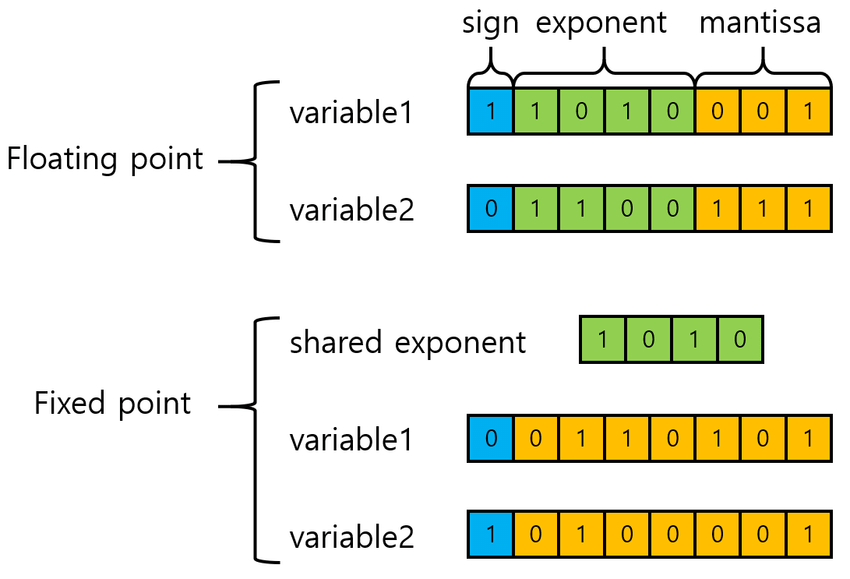
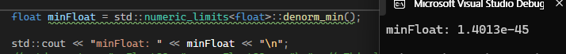

# Section 3

## 3.2 Integral Data Types
    ### 3.1 Fixed width Integers, 고정 너비 정수 타입
        - 고정너비 타입들은 <cstdint> 헤더에 정의 되어 있습니다. 
        - 이 타입들은 아키텍쳐에 관계 없이 일정한 크기를 가집니다. 
            - 이는 예전에 제조사, 운영체제, 프로세서에 따라 정수비트의 크기가 다른 문제를 해결하기 위한 대안이라고 볼 수 있습니다. 
        - int8_t, uint8_t ... int64_t, uint64_t 의 고정너비 타입이 있으며, C++에서 널리 사용되는 int와 unsigned와는 다릅니다.
        - 참고로 int*_t 타입은 실제 독립적은 타입이 아니고, 기본타입에 대한 별칭입니다.
        - C++ 표준은 char , short, int, long, long등 기본적인 정수 타입을 제공합니다. 
        - ** 그러나 C++표준이 int*_t 타입을 기본타입과 일대일로 매핑하는 것은 아닙니다.
            - 즉 시스템에서 정확한 크기의 기본타입을 제공하지 않는다면 동작하지 않을 수 있다는 뜻이며, 이식성을 생각할때 고려요소 중 한가지가 될 수 있겠습니다.
        - 주의: I/O Stream에서는 uint8_t와 int8_t를 char로 해석합니다.
            - 근데 제 컴퓨터에서는 cout<<var구문에서 부터 에러가 나는 것 같습니다..
            ```
                int8_t var;
                cin >> var; // read '2'
                cout << var; // print '2'
                int a = var * 2;
                cout << a; // 100 이 출력됩니다 !!
            ```
    ### 3.2 size_t, ptrdiff_t
        - <stddef.h> 헤더에 정의된 size_t와 ptrdiff_t 는 아키텍쳐에 따라 가장 큰 크기를 저장할 수 있는 타입의 별칭 입니다.
            - 여기서 가장 큰 크기라 함은 예를들어 64bit 아키텍쳐에서는 8btyte를, 32bit 아키텍쳐에서는 4byte를 사용할 수 있게 한다는 것입니다.
        - size_t는 부호 없는 정수 타입이며, 최소 16비트 크기를 가지게 됩니다.
        - ptrdiff_t 는 size_t 의 signed 버전이며, 포인터차이를 계산할 때 사용되게 됩니다
            - 메모리 내의 두 위치사이의 거리 (오프셋) 을 나타낼 때 사용합   니다. 부호있는 타입으로 음수값을 가질 수 있어, 한 포인터가 다른 포인터 보다 앞에 있느 경우 음수 값을 반환할 수 도 있습니다. 
        - size_t의 리턴타입은, size_t 이며, 크기를 나타내는데 흔히 사용됩니다.
        - C++ 23에서는 size_t와 ptrdiff_t를 위해 uz?UZ와 z/Z를 사용합니다. 

## 3.2 Signed/Unsigned Integer Characteristics
    - Signed와 Unsigned 정수는 동일한 하드웨어를 사용하지면, Semantic에서 큰 차이를 보입니다.
    - 기본개념은 다음과 같습니다.
        오버플로우 : 산술연산 길이가 단어 길이를 초과하여, 표현할 수 있는 가장 큰 양수/음수 값보다 큰 경우를 말합니다.
        Wraparound : 
            - 특정 범위가 넘어가면 다시 처음으로 (해당타입이 표현할 수 있는 가장 작은 수) 돌아가는 것을 의미합니다.
            - 산술 연산의 결과가 2^N  모듈로로 감소하며, N은 여기서 단어의 비트 수 입니다. 
            - 즉 오버플로우가 발생하면 랩어라운드가 일어납니다. 최대값을 초과하는 산술 연산의 결과는 0 부터 다시 시작하며, 이것은 모듈로 연산으로 다시 reduced 되었다고 표현합니다. 
            ``` 
            uint8_t num = 255; // uint8_t는 0부터 255까지 값을 가질 수 있습니다.
            num = num + 1;     // 여기서 랩어라운드가 발생합니다 256을 가질수 없으니 다시 0으로 돌아갑니다.2^N(256) 범위 안에서 연산이 //이루어지기 때문입니다. 
            std::cout << static_cast<int>(num) << std::endl; // 출력 결과는 0입니다
            return 0;
            ``` 
## 3.3 Promotion and Truncation
    - 큰 타입으로 프로모션 되는 경우에는 부호를 유지합니다.
    - Truncation 이란, 변수가 더 작은 데이터 타입으로 변환될 때 일어나는 과정입니다. 
        Truncation의 경우, 더 작은 타입으로의 Truncation은 모듈로 연산을 사용합니다. 즉 Wraparound가 일어나게됩니다. 
        ```
        int x = 65537; // 2^16 + 1
        int16_t y = x; // 결과는 2^16 모듈로 연산
        cout << y;     // print 1

        int z = 32769; // 2^15 + 1 (int16_t 범위를 넘음)
        int16_t w = z; // 결과는 2^16 모듈로 연산, 즉 32768에서 + 1 값을  Wraparound 한 -32767 이 됩니다. 
        cout << w;     // print -32767
        ```

## 3.4 Undefined Behavior 
    : 프로그래머는 변수의 범위를 주의깊게 관리해야합니다. 
    정의되지않은 행동이 일어날 수 있는 경우는 다음과 같습니다.
        - 정수가 자신이 표현할 수 있는 정수 범위를 넘어서는 경우
        - 부호 있는 정수 타입에서, 비트연산 시 
            - 예를 들어, 쉬프트연산으로 sign bit를 변경하는 것은 특히 위험 할 수 있습니다. 
        - 데이터 타입이 표현할 수 있는 비트수 보다 큰 시프트 연산을 수행하는 경우
        - 암묵적 형 변환에서, 부호없는 타입을 넘어서는 값으로 변환하려는 경우 (정수 오버플로우)
    - 정말 안좋은 예시
        - 아래 예시는 컴파일러 최적화 활성화시, 오버플로우를 유발합니다. 
        - i*100000000 연산시 오버플로우 발생 == Undefined Behavior -> 코드 경로 제거 가능 -> 즉 컴파일러가 루프 탈출 조건 체크를 제거할 가능성 -> 무한루프 발생
        ```
                int main() {
        for (int i = 0; i < 4; ++i)
        std::cout << i * 1000000000 << std::endl;
        }
        // with optimizations, it is an infinite loop
        // --> 1000000000 * i > INT_MAX
        // undefined behavior!!
        // the compiler translates the multiplication constant into an addition
        ```
        - 
            -직접 돌려보니 무한루프가 나오진 않았다, 컴파일러 최적화가 적용이 안된 걸 수 있음.

    안전한 루프 작성방법
        - 변수가 그 타입의 최대값에 도달하지 않도록 주의합니다.
        - 루프 조건과 증감 연산자에서 오버플로우가 발생하지 않도록 충분한 여유를 줘야합니다.
        - 변수가 최대값에 근접할 수 있는 연산을 할때는 오버플로우를 감지하고 처리할 수 있는 로직을 추가해야합니다.
            -예시로<limits> 헤더를 추가하여, 연산 수행시 오버플로우 가능성을 검사할 수있습니다. 
            - std::numeric_limits<int>::max() 를 사용할 수 있습니다. 


## 2 Floating-point Types and Arithmetic

### 2.1 IEEE FLoating-Point Standard Overview
    - IEEE754
        - Institute of Electrical and Electronics Enginners
        - 부동 소수점의 연산을 위해 채택된 국제적인 표준을 의미합니다.
        - 이진 형식, 연산 규칙, 반올림, 예외처리를 표준화 합니다. 
        - 다시말해 위와 같은 항목을 표준화 하여, 컴퓨터간에 숫자를 일관적으로 처리하도록 정의한 것 입니다.
        - 표준연혁
            - 첫 릴리즈 : 1985
            - 두번째 릴리즈 : 2008 Add 16-bit, 128bit, 256 bit등의 다양한 비트길이의 부동 소수점 타입 추가
            - 세번째 릴리즈: 2019, 최소/최대 처리방식에 대해 규칙을 명시합니다 
        - C/C++ 은 IEEE754 표준을 따릅니다 (<numveric_limits>)
    - 비표준 방식 (Non-Standardized in C++/IEEE)
        - TensorFloat-32
            -딥러닝 응용프로그램을 위한 특수한 포맷의 부동소수점 입니다.
            - NVIDIA의 최신 GPU 아키텍쳐에서 사용되는 부동소수점 형식입니다. 
            - https://blogs.nvidia.com/blog/tensorfloat-32-precision-format/
        -Posit
            - John Gustafson에 의해 2017년 제안됨, unum III라고도 불립니다.
            - 지수부와 가수부의 가변 너비를 가지는 부동소수점 값을 표현합니다.
            - 실험적 플랫폼에서 구현되었습니다.
        _Microscaling Formats(MX)
            - AMD, Arm, Intel, Meta, Microsoft, NVIDIA, Qualcomm이 정의한 저정밀도 부동소수점 형식입니다.
            - FP8, FP6, FP4, (MX)INT8을 포함합니다.
        Fixed Point
            - 임베디드 시스템에서 많이 사용됩니다.
            - 소숫점 이하 자리가 고정된 형식입니다.
            - 인접한 숫자 간격이 항상 동일합니다.
                - 인접한 숫자간격이 동일하지 않을 수도 있다는 것은, 100.1과 100.2 사이의 차이가 0.1,0.2사이의 간격과 정밀도 이슈로 인해 동일하지 않을 수 있다는 것을의미합니다.
                - 큰 숫자일수록 간격이 더 커질 수 있는데,
            - 값의 범위가 부동 소수점 수에 비해서 상당히 제한적입니다. 
            

   
### 2.2 Normal / Denormal Number 
    - 정상수와 비정상수
    
   

    - ...가 아니고 정규화된 숫자와 비정규화 숫자
    - 정규화 수 (Normal Number)
        - 부동소수점 방식으로 표현된 소수 중에서(mantissa x 2 ^ exponent), 지수에 적어도 하나이상의  비트로 표현되거나, 가수가 모두 0인경우를 말합니다
        - 예시로, 156.25 = 1.001110001 * 2^7 입니다.
    - 비정규화수 (Denormal number)
        - 기본적으로 정규화가 불가능한 숫자들을 말합니다.
        - 지수가 모두 0이고, 가수가 0이아닌 값으로 표현되는 부동소수점을 말합니다. 
        - 예를들어 0.000000000001 같은 경우 가장 작은 정상수,1.0 2^-126보다 작으므로 정규화 할 수 없기에 가수부분만 가지고 표현하게됩니다.
        - 추가 하드웨어 지원없이 느리게 진행 되며, underflow를 방지하고, 0으로 반올림을 막아주는 방식으로 진행됩니다.
        -참고: "std::numeric_limits<float>::denorm_min(); 이용해 가장 작은 수를 표현한 경우 
        


### 2.3  Infinity
    - Infinity값이란, IEEE754의 기준으로, 최대,최소로 표현가능한 숫자(repsentable value)를 초과한 값을 말합니다. 
    - 수학적인 개념보다, 오류를 나타내거나 예외처리를 위한 용도로 사용되는 경우가 꽤 있습니다. 
    - 비교연산 특징
        - inf != finite_value 
        - ±inf == ±inf
    - Inifnity가 생성되는 연산
        - +∞ 연산 +∞
        - +∞ 연산 finite_value
        - finite_value 연산 finite_value > max_value
        - non-NaN / 0
    ```
        std::cout << 0 / 0;          // 정의되지 않은 행동(undefined behavior)
        std::cout << 0.0 / 0.0;      // "nan" 출력
        std::cout << 5.0 / 0.0;      // "inf" 출력
        std::cout << -5.0 / 0.0;     // "-inf" 출력

        auto inf = std::numeric_limits<float>::infinity();
        std::cout << (-0.0 == 0.0);  // true, 0은 0과 같음
        std::cout << ((5.0f * inf) == (-5.0f * inf)); // true, 0은 0과 같음
        std::cout << ((10e40f) == (10e40f + 9999999.0f)); // true, inf는 inf와 같음
        std::cout << ((10e40f) != (10e40f + 9999999.0f)); // false, 10e40는 inf가 아님
    ```
### 2.4 Not A Number (NaN)
    - IEEEStandar를 기준으로, NaN은 정의되지않았거나, 표현할 수 없는 값을 의미합니다. 
    - 예를들면 허수나 숫자자체로 표현되지 않는경우를 말합니다. 
    - 특징
        - (NaN == NaN) → false
        - 모든 x에 대하여, (NaN != x) 
    - NaN이 발생되는 예시 
     - ±∞ · ∓∞ , 0 · ∞
     - 0/0, ∞/∞
     - √x, log(x) for x < 0
     - sin−1(x), cos−1(x) for x < −1 or x > 1

### 2.5 Machine epsilon (머신 입실론)
    - Machine Epsion ε 혹은 Machine accuray는, 가장 작은 숫자를 발합니다.
        - 예를들어, 1.0이 있다면, 최소 이 엡실론 만큼은 더해줘야 다른숫자로 인식됩니다.
        - 당신의 자에 밀리미터 눈금이 마지막이라면, 그 상황의 밀리미터가 바로 엡실론입니다.
    - IEEE 754 single precision  ;  ε = 2−23 ≈ 1.19209 ∗ 10−7
    - IEEE 754 double prrecision ;  : ε = 2−52 ≈ 2.22045 ∗ 10−16

### 2.6 Units at the Last Place (ULP)
    - ULP란, IEEE 부동소수점표준을 따르는 연속적인 부동 소수점 숫자들 사이의 간격을 의미합니다.
    - 식으로 ULP(p, e) = β^e−(p−1) → 2^e−(p−1)와 같이 표현합니다.
    - 참고) 정밀도p로만 ULP를 정의하지않고 지수부분인 e까지 사용하는 이유는 다음과같습니다.
        - 부동소수점에서, 숫자의 크기가 지수에 의해서 결정되기 때문입니다.
        - 예를들어 1.23x10^3과, 1.23x10^6은 동일한 정밀도를 가집니다. 하지만 지수부분으로 인해 스케일이 달라집니다.
        - 이에 정밀도만 정의하면, 실제 크기에따른 정밀도를 정의할 수 없게됩니다. 
    - β는 기수(radix), p는 정밀도, e는 지수를 의미합니다.
        - 예시
            -  β =10이고, p =3일때,
            -  π = 3.14159.... x = 3.14 x 10^0
            -  ULP(3,0) => 정밀도가 3이고 지수가 0이다 = 10^-2 = 0.01 
    - 컴퓨터 계산시 **정밀도의 한계**를 이해하는데 도움이 됩니다.
        - 예를들어 부동소수점 연산시 생길 수 있는 오차추정, 영향예측등에 사용할 수 있습니다.
    - ULP와 Machine Epsilon의 관계 
        - ε = ULP(p, 0)
        - ULPx = ε ∗ β^e(x)

### 2.7 CheatSheet
    - Floating-point Number Representations Cheat Sheet
    -아래사진은, float의 예시로 1개의 sign ,8개의 지수, 그리고 23개의 가수 (mantissa) 가 있을때, NaN, Infinity, Lowest, Minimum,Largest등이 어떻게 표현되는지 나타냅니다.
    - 예를들어 infinity는 sign비트와 관계없이, 11111111 / 00000000000000000000000과 같이 표현됩니다. 
    -참고내용
        - Bias는 편향값을 의미합니다.
            - 컴퓨터가 음수를 저장할때 추가적 연산없이 효율적으로 처리하기 위해 만들어졌습니다. 
            - 예를들어 8비트의 편항값은 127이므로, 지수에서 127을뺀 -127~128까지 표현이 가능합니다. 
        -bfloat16은 "Braining Floating Point"의 약자로, 구글이 딥러닝 연산을 위해 만든 부동 소수점 형식을 의미합니다. 
            -8비트의 지수와  7비트의 가수를 사용하여 더 넓은 범위의 수를 표현할 수 있으나, float,double에 비해 정밀도는 낮습니다. 
- 
- 
  

### 2.8 Floating-point Arithmetic Properties
    :부동 소수점 연산의 성질
        - 개요
        부동 소수점은  실제 수학적인 연산과 다른 성질을 가지고있으므로, 이를 정확히 이해함으로써 오차를 최소화 할 수 있습니다.
        - 성질
            1. 일반적으로 더하기,빼기,나누기,곱하기는 정확한 정밀도로 수행되지 않을 수 있습니다.
            2. NaN의 경우 반사성,Reflexivity를 가지지 않습니다. 
                - 반사관계란, 모든 원소가 자기자신이랑 대응이 있는경우를 말합니다. (즉, 자기자신과 비교했을때 항상 참)
                -하지만 NaN의 경우 비트표현에서 보았듯이, * / 11111111 / *************... 와같이 표현됩니다.
                -이는 *****에 무수한 경우가 올 수 있고, 똑같이 NaN이라 하여도 NaN==NaN을 보장할 수 없다는 것을 의미합니다. 
                - 참고
                    - 행렬에서, 반사관계에 대한 행렬은 대각원소가 모두 1인경우를 말합니다. 
                    - 즉 모든 원소에 대하여 루프가 존재합니다
                    - 비반사와 반사는 여집합관계이며, 동시에 불가능합니다. 
            3. NaN의 경우 교환법칙이 성립하지 않습니다.
                - Nan != NaN => NaN + a != NaN + a => a + NaN != NaN + a
            4. 부동 소수점 연산의 경우, 결합 법칙이 성립하지 않습니다.
                - 예를들어 a + (b + c) 와 (a + b) + c 에서 a + b 값이 너무 크거나 작을경우 유효하지 않은 숫자가 생략 될 수 있습니다.  
            5. 분배법칙이 성립하지 않습니다.
                - 곱셈과 덧셈사이에 정확한 분배법칙이 적용되지 않습니다.
                - a * (b + c) = a * b + a * c를 의미하는데, a가 매우작은 수이고, b + c단계에서, 오버플로우로 인해 inf가 되는 경우를 가정하면 우변과 좌변이 일치하지 않을 수 있게됩니다. 
            6. 연산에 대한 항등성이 보장되지 않습니다. 
                - k를 a로 나누고 a를 다시 곱할때, 이 값이 k와 동일하다는 보장을 할 수 없습니다.
                - 예시
                     - NaN + 0 != NaN
                     - 매우작은 부동소수점 수 같은 반올림오차  
            7. 오버플로우,언더플로가 없습니다. 
                - inf,-inf에서 포화상태(Saturation)이 되며, 더하기 연산에서 inf나 -inf에 이르기 전에 포화될 수 있습니다.

### 2.9 Detect Floating-point Errors
    - C++11 의 <cfenv> 헤더는 부동소수점 관련 오류를 감지 및 처리하는 기능을 제공합니다.
    - 0으로 나눔연산, 부정확한 반올림,비유효 검사, 오버플로우, 언더플로우 등이 포함됩니다.
    ```
    #include <cfenv>
    FE_DIVBYZERO
    FE_INEXACT
    FE_INVALID
    FE_OVERFLOW
    FE_UNDERFLOW
    FE_ALL_EXCEPT

    //예시 
    #include <cfenv> // floating point exceptions
    #include <iostream>
    #pragma STDC FENV_ACCESS ON     /* 전처리기: 부동소수점 환경에 대한 접근을 필요로 한다는 것을 알립니다.
    */ 모든 컴파일러가 지원하는것은 아니며, gcc는 지원하나 clang은 지원하지 않습니다.  

    // environment (not supported by all compilers)
    // gcc: yes, clang: no
    int main() {
    std::feclearexcept(FE_ALL_EXCEPT); // clear
    auto x = 1.0 / 0.0; // all compilers
    std::cout << (bool) std::fetestexcept(FE_DIVBYZERO); // print true
    std::feclearexcept(FE_ALL_EXCEPT); // clear
    auto x2 = 0.0 / 0.0; // all compilers
    std::cout << (bool) std::fetestexcept(FE_INVALID); // print true
    std::feclearexcept(FE_ALL_EXCEPT); // clear
    auto x4 = 1e38f * 10; // gcc: ok
    std::cout << std::fetestexcept(FE_OVERFLOW); // print true
    }
    ``` 


## 3 **Floating Point Issues**

- ### 3.1 Catastrophic Cancellation
    부동소수점 계산에서 되돌릴 수 없는(*자료에서 reversed가 오타난듯..revered로 해석이 안됨) 관련 정보 손실을 나타냅니다.
    - 발생하는경우
        1. 한 숫자가 다른 숫자에 비해 마우 클 때, 더 작은 숫자의 값이나 값의 일부가 손실될 수 있습니다.
        2. 두 숫자가 서로 근사값일때, 두 숫자의 차는 결과의 중요한 부분의 대부분을 상쇄시킵니다. 즉, 절대오차는 작을 수 있으나, 상대오차는 매우 큽니다.
    - Granularity
        - 부동소수점의 값이 커짐에 따라 표현할 수 있는 값 사이의 간격이 점점 멀어지는 것을 알려줍니다.
        - 즉 숫자가 서로 매우 비슷한 값일 경우, 부동 소수점 계산의 정밀도 한계를 고려해야 합니다.
    - 사례
        1.무한 루프 
            아래와 같은경우 무한루프가 발생합니다.
                - 부동소수점은 특정 범위가 넘어가면 더 작은 변화를 감지 할 수 없습니다.
            ```
            while (x > 0)
            x = x - y  // 여기서 x가 30,000,000(float가 표현할 수 있는 최대치에 근접한 값),
            ```
        2. 점진적으로 값이 증가해도, 변화가 없어질 수 있습니다.
        ```
        float x =0.0f;
        for (iint i=0; i<20000000000; i++)
        x +=1.0f //print 1.67772e+07.
        ```
        3. 천장나눗셈 (ceiling division)의 경우,나눗셈에서 값이 손실되지않고 연산이 정확히 수행됩니다. 

        4. 이차방정식의 해를 구할때, 숫자들의 차이가 너무커서 정확한 해를 구하지 못할 수 있습니다. 
            - 예를들면 x^2 + 5000x + 0.25 = 0의 해를 구할때, 수학적으로는 0.00005 지만, 부동소수점 연산의 결과적으로 0으로 표현될 여지가 있습니다. 

   

        


       

