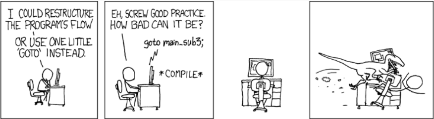

# If 구문
- 지정된 조건이 true면 첫 번째 분기를 실행하고 그렇지 않으면 두 번째 분기를 실행
- 삼항 연산자
    ```
    <condition> ? <expression1> : <expression2>;
    ```
    - `<expression1>`과 `<expression2>`는 같은 값을 반환하거나 변환가능한 타입
<br></br>
# for, while 구문
- for 구문
    - 반복 횟수를 알 경우 사용
    ```
    for ([init]; [cond]; [increment]) {
        ...
    }
    ```
- while 구문
    - 반복 횟수를 모를 경우 사용
    ```
    while (cond) {
        ...
    }
    ```
- do while 구문
    - 반복 횟수는 모르지만 반드시 한 번은 실행해야 할 경우 사용
    ```
    do {
        ...
    } while (cond);
    ```
# for 구문의 특징
- C++은 루프 안에 정의를 허용
    ```
    for (int i = 0, k = 0; i < 10; i++, k += 2)
        ...
    ```
- 무한 루프
    ```
    for (;;)            // also while(true);
        ...
    ```
- Jump Statement
    ```
    for (int i = 0; i < 10; i++) {
        if (<condition>)
            break;      // exit from the loop
        if (<condition>)
            continue;   // continue with a new iteration and exec. i++
        return;         // exit from the function
    } 
    ```
# 범위 기반 for 루프
- C++11에 도입
- 더 안전함
- 루프의 시작, 끝 및 증분을 지정하지 않음
```
for (int v : { 3, 2, 1 })   // INITIALIZER LIST
    cout << v << " ";       // print: 3 2 1

int values[] = { 3, 2, 1 };
for (int v : values)        // ARRAY OF VALUES
    cout << v << " ";       // print: 3 2 1

for (auto c : "abcd")       // RAW STRING
    cout << c << " ";       // print: a b c d
```
- C++17부터 구조체 결합을 위한 개념 확장
```
struct A {
int x;
int y;
};

A array[] = { {1,2}, {5,6}, {7,1} };
for (auto [x1, y1] : array)
    cout << x1 << "," << y1 << " ";     // print: 1,2 5,6 7,1
```
# Switch 구문
- 식(`int`, `char`, `enum`, `enum class`)을 평가하고 일치하는 케이스 값과 관련된 구문을 실행
    ```
    char x = ...
    switch (x) {
        case 'a':
            y = 1; 
            break;
        default:
            return -1;
    }

    return y;
    ```
- 범위
    ```
    int x = 1;
    switch (1) {
        case 0: int x;          // nearest scope
        case 1: cout << x;      // undefined!!
        case 2: { int y; }      // ok
        //case 3: cout << y;    // compile error
    }
    ```
- Fall-through
    ```
    MyEnum x
    int y = 0;
    switch (x) {
        case MyEnum::A:         // fall-through
        case MyEnum::B:         // fall-through
        case MyEnum::C:
            return 0;
        default:
            return -1;
    }
    ```
- C++17부터 `[[fallthrough]]` 특성을 사용할 수 있음
    ```
    char x = ...
    switch (x) {
        case 'a': 
            x++;
            [[fallthrough]];    // C++17: avoid warning
    case 'b':
        return 0;
    default:
        return -1;
    }
    ```
# 초기화 구문을 사용한 제어 흐름
- 복잡한 작업을 단순화하고 제어 흐름 본체에서만 볼 수 있는 변수의 범위를 제한
- C++17
    - `if` 구문
        ```
        if (int ret = x + y; ret < 10)
            cout << ret;
        ```
    - `switch` 구문
        ```
        switch (auto i = f(); x) {
            case 1:
                return i + x;
        }
        ```
- C++20
    - 범위 기반 `for` 구문
        ```
        for (int i = 0; auto x : {'A', 'B', 'C'})
        cout << i++ << ":" << x << " ";         // print: 1:A 2:B 3:C
        ```
# goto 구문
- `goto` 구문을 통해 원하는 지점으로 넘어갈 수 있음
    ```
    for (int i = 0; i < N; i++) {
        for (int j = 0; j < M; j++) {
            if (<condition>)
                goto LABEL;
        }
    }

    LABEL: ;
    ```
- 사용 지양

<br></br>
# Avoid Unused Variable Warning [[maybe unused]]
- 대부분의 컴파일러는 변수가 사용되지 않을 때 경고 발행
- C++17은 이 경고를 방지하기 위해 `[[maybe_unused]]` 특성을 사용
    ```
    int f(int value) {
	    [[maybe_unused]] int x = value;
#if defined(ENABLE_SQUARE_PATH)
	    return x * x;
#else
	    //static_cast<void>(x);     // before C++17
	    return 0;
#endif
    }

    template <typename T>
    int f([[maybe_unused]] T value) {
	    if constexpr (sizeof(value) >= 4)
		    return 1;
	    else
		    return 2;
    }

    template <typename T>
    int g([[maybe_unused]] T value) {
	    using R = decltype(value);
	    return R{};
    }
    ```
## 자료
- https://github.com/federico-busato/Modern-CPP-Programming/blob/master/04.Basic_Concepts_III.pdf