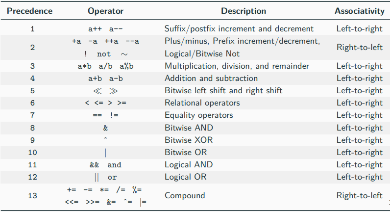
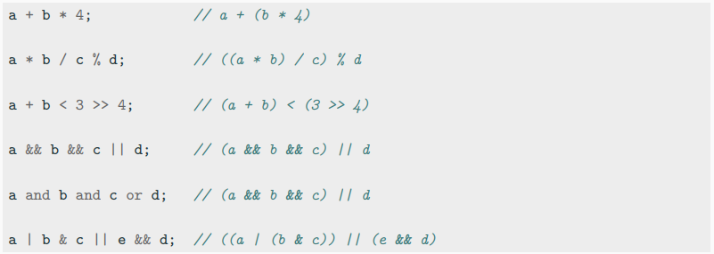
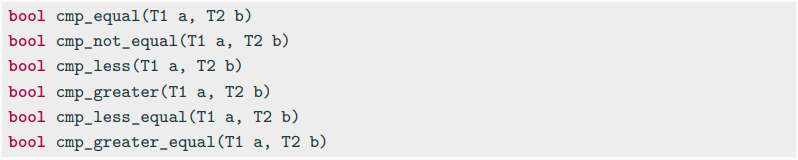

# 연산자

# 연산자 우선순위
- 단항 연산자가 이항 연산자보다 우선순위가 높음
- 기본 수학 연산자(+, *, etc.)들이 비교, 비트, 로직 연산자보다 우선순위가 높음
- 비트, 로직 연산자가 비교 연산자보다 우선순위가 높음
- 복합 연산자는 낮은 우선순위
- 콤마 연산자는 가장 낲은 우선순위


# 전위/후위 연산자
- 전위 연산자 `++i`, `--i`
    1. 값 업데이트
    2. 업데이트된 새로운 값을 반환
- 후위 연산자 `i++`, `i--`
    1. 이전 값을 저장
    2. 값 업데이트
    3. 이전 값을 반환
<br></br>
# 정의되지 않은 동작 순서 지정
```
int i = 0;
i = ++i + 2;        // since C++11 : i = 3

i = 0;
i = i++ + 2;        // since C++17 : i = 3

f(i = 2, i = 1);    // since C++17 : i = 2

i = 0;
a[i] = i++;         // since C++17 : a[1] = 1

f(++i, ++i);        // 미정의 동작
i = ++i + i++;      // 미정의 동작
```
# 대입, 복합, 콤마 연산자
- 대입, 복합 연산자는 오른쪽부터 왼쪽으로 연산하며 할당된 값을 반환
- 콤마 연산자는 왼쪽에서 오른쪽으로 연산하며 왼쪽 식을 평가하고 결과를 버린 후, 오른쪽 식을 반환
<br></br>
# 우주선 연산자 `<=>`
- C++20부터 제공
- 두 객체의 비교를 양수, 0, 음수로 구분
- 모든 객체로 확장 가능하며, 비교 연산자의 과부하를 크게 단순화할 수 있음
```
1 <=> 1 ...  0
1 <=> 2 ... -1
2 <=> 1 ...  1
```
# 안전한 비교 연산자
- C++20부터 <utility>를 통해 `signed`, `unsigned`의 정수를 안전하게 비교할 수 있음


## 자료
- https://github.com/federico-busato/Modern-CPP-Programming/blob/master/02.Basic_Concepts_I.pdf
- https://en.wikipedia.org/wiki/Three-way_comparison
- https://en.cppreference.com/w/cpp/utility/intcmp
