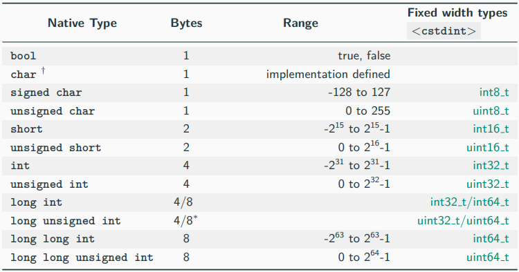
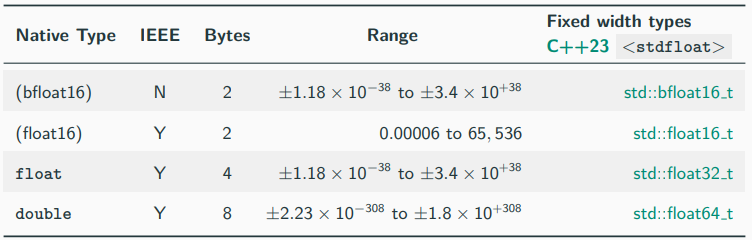
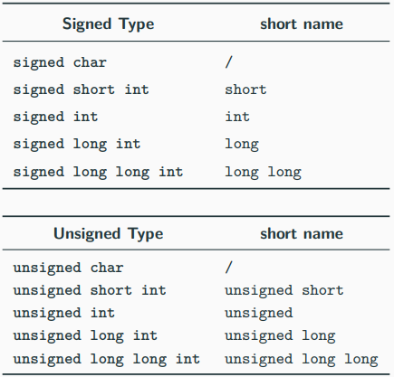
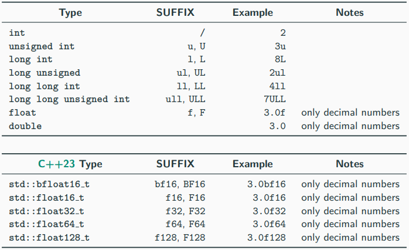
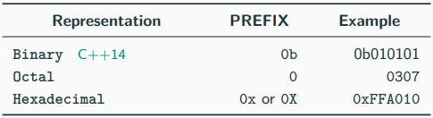

# 상수 타입
- 정수형 

- 부동 소수점 

- 약어 

- 접미사 

- 접두사 

  
# 이외의 상수 타입
- 8/12/16 byte 크기의 long double을 제공
- C++23 이전의 부동 소수점 지원 감소
- C++은 128bit 정수를 제공하지 않음
  
# void 타입
- 값이 없는 불완전한 타입
- 반환 유형이 없거나 매개 변수가 없는 함수
  
# nullptr 키워드
- C++11에서 null 포인터를 나타냄
- NULL 매크로를 대체하기 위해 nullptr 도입
  
## 자료
- https://github.com/federico-busato/Modern-CPP-Programming/blob/master/02.Basic_Concepts_I.pdf
