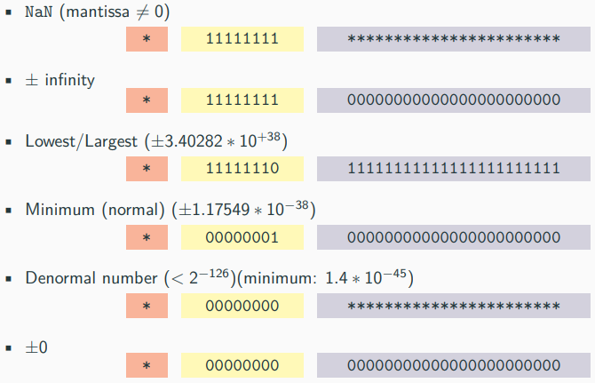

# IEEE 부동 소수점
- IEEE754는 부동 소수점 연산의 기술 표준
- 일반적으로 C/C++는 IEEE754 부동 소수점 표준을 채택
<br></br>
# 부동 소수점
|종류|부호|지수부|가수부|타입|
|---|---|---|---|---|
|단일 정밀도|1bit|8bit|23bit|`float`|
|2배 정밀도|1bit|11bit|52bit|`double`|
|4배 정밀도|1bit|15bit|112bit|`std::float128`(C++23)|
|8배 정밀도|1bit|19bit|236bit|C++에 표준화되지 않음|
# 16비트 부동 소수점
|종류|부호|지수부|가수부|타입|사용|
|---|---|---|---|---|---|
|IEEE754|1bit|5bit|10bit|`std::binary16`(C++23)|GPU, Arm7|
|Google|1bit|8bit|7bit|`std::bfloat16`(C++23)|TPU, GPU, Arm8|
# 8비트 부동 소수점
- C++/IEEE에 표준화되지 않음

|종류|부호|지수부|가수부|
|---|---|---|---|
|E4M3|1bit|4bit|3bit|
|E5M2|1bit|5bit|2bit|
# 기타
- C++/IEEE에 표준화되지 않음
- TensorFloat-32(TF32)
    - 딥러닝 응용을 위한 특화된 부동 소수점 포맷
- Posit
    - 지수부와 가수부의 폭이 가변적인 부동 소수점
    - unum III(유니버설 넘버)라고 불림
- Microscaling Format(MX)
    - 저정밀 부동소수점 포맷
    -  FP8, FP6, FP4, (MX)INT8 포함
- Fixed-point
    - 소수점 뒤에 고정된 숫자
    - 인접한 숫자들 사이의 간격은 항상 같음
    - 부동 소수점 숫자에 비해 범위가 상당히 제한적
<br></br>
# Normal/Denormal
- 정규값(Normal number)
    - 지수부에 한 비트라도 설정되거나 가수부가 모두 0인 부동 소수점 수
- 비정규값(Denormal number)
    - 부동 소수점 연산에서 0 주변의 언더플로우 갭을 채움
    - 지수부가 모두 0이지만 가수부는 0이 아닌 부동 소수점 수
<br></br>
# 무한대 (Infinity)
- IEEE754 표준에서 `inf`(infinity value)는 최대(또는 최소) 표시 가능한 값을 초과하는 숫자 데이터 타입
- 비교
```
(inf == finite_value)   → false
(±inf == ±inf)          → true

ex)
cout << 0 / 0;          //undefined behavior
cout << 0.0 / 0.0;      //print "nan"
cout << 5.0 / 0.0;      //print "inf"
cout << -5.0 / 0.0;     //print "-inf"

auto inf = std::numeric_limits<float>::infinity;
cout << (-0.0 == 0.0);                      // true, 0 == 0
cout << ((5.0f / inf) == ((-5.0f / inf));   // true, 0 == 0
cout << (10e40f) == (10e40f + 9999999.0f);  // true, inf == inf
cout << (10e40) == (10e40f + 9999999.0f);   // false, 10e40 != inf
```
# Not a Number(NaN)
- IEEE754 표준에서 `NaN`(not a number)는 정의되지 않거나 표현할 수 없는 값을 나타내는 숫자 데이터 타입
- 비교
```
(NaN == x)      → false, 모든 x에 대해
(NaN == NaN)    → false
```
# Machine epsilon
- 1.0에 더했을 때 1이 아닌 다른 값을 주는 가장 작은 수(ε, machine accuracy)
    - IEEE754 단일 정밀도 : ε = 2<sup>-23</sup> ≈ 1.19209 ∗ 10<sup>−7</sup>
    - IEEE754 2배 정밀도 : ε = 2<sup>-52</sup> ≈ 2.22045 ∗ 10<sup>−16</sup>
<br></br>
# ULP(Units at the Last Place)
- 연속적인 부동 소수점 수 사이의 간격
- $ULP(p,e)=β^{e−(p−1)} → 2^{e−(p−1)}$
- ε(Machine epsilon)과의 관계
    - $ε=ULP(p,0)$
    - $ILP_x=ε∗β^e(x)$
# 실수의 부동 소수점 표현
- $fl(x)=x(1 + δ)$
    - δ : 작은 상수
    - x는 아래와 같은 성질을 가짐
        - 절대 오차 : $|fl(x) − x|$ $≤$ $1\over2$ · $ULP_x$
        - 상대 오차 : $|\frac{fl(x)-x}{x}|$ $≤$ $1\over2$ · $ε$
# Cheatsheet

# Limits
```
#include <limits>
// T : float or double

std::numeric_limits<T>::max();          // largest value
std::numeric_limits<T>::lowest();       // lowest value (C++11)
std::numeric_limits<T>::min();          // smallest value
std::numeric_limits<T>::denorm min()    // smallest (denormal) value
std::numeric_limits<T>::epsilon();      // epsilon value
std::numeric_limits<T>::infinity()      // infinity
std::numeric_limits<T>::quiet NaN()     // NaN
```
# Useful Functions
```
#include <cmath>                // C++11
bool std::isnan(T value)        // NaN 체크
bool std::isinf(T value)        // ±infinity 체크
bool std::isfinite(T value)     // !NaN && !±infinity

bool std::isnormal(T value);    // Normal 체크

T std::ldexp(T x, p)            // 지수부 왼쪽으로 시프트
int std::ilogb(T value)         // 지수부 값 추출
```
# 산술 특성
- 사칙 연산이 가능
- 실제 연산이 다름
- 비반사 관계
    - NaN을 제외하면 반사 관계
- 교환법칙 성립 X
    - NaN을 제외하면 교환법칙 성립
- 결합법칙 성립 X
- 분배법칙 성립 X
- 아래의 식과 같이 식의 값 보장 X
    - $(k/a)*a≠k$
- 오버플로우 / 언더플로우가 없음
    - inf / -inf 존재
<br></br>
# 부동소수점 에러 탐지
- `<cfenv>`를 통해 부동 소수점 예외 조건이 발생했는지 여부를 판단할 수 있음
```
#include <cfenv>
// MACRO
FE_DIVBYZERO    // division by zero
FE_INEXACT      // rounding error
FE_INVALID      // invalid operation, i.e. NaN
FE_OVERFLOW     // overflow (reach saturation value +inf)
FE_UNDERFLOW    // underflow (reach saturation value -inf)
FE_ALL_EXCEPT   // all exceptions

// functions
std::feclearexcept(FE_ALL_EXCEPT);  // clear exception status
std::fetestexcept(<macro>);         // returns a value != 0 if an exception has been detected
```
## 자료
- https://github.com/federico-busato/Modern-CPP-Programming/blob/master/03.Basic_Concepts_II.pdf
- https://devocean.sk.com/blog/techBoardDetail.do?page=&boardType=undefined&query=&ID=165270&searchData=&subIndex=

