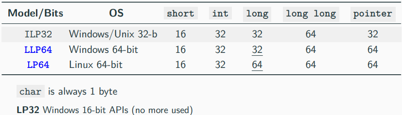
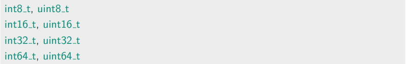

# C++ Data model

# 고정 길이 정수형
- C++에서는 고정 길이 정수형을 제공하며, 어느 아키텍처에서든 같은 사이즈를 가짐

- 네이티브 타입 대신 고정 길이 정수 선호
- `int*_t`는 실제 타입이 아님
    - 4가지 오버로드가 있음 (`int8_t`, `int16_t`, `int32_t`, `int64_t`)
- I/O Stream에서 `uint8_t`와 `int8_t`는 `char`처럼 정수형으로 인식하지 않음
  
# size_t와 ptrdiff_t
- 현재 아키텍처에서 저장할 수 있는 가장 큰 값을 나타내는 별칭 데이터 타입
- size_t
    - 부호가 없는 정수형 타입
    - `sizeof()`의 반환타입이며, 일반적으로 크기를 표현할 때 사용
    - C++23부터 `uz`/`UZ` 리터럴
- ptrdiff_t
    - `size_t`의 부호 있는 정수형 타입
    - 포인터 뺄셈을 계산하는 데 사용
    - C++23부터 `z`/`Z` 리터럴
- 32-bit 아키텍처에서는 4bytes, 64-bit 아키텍처에서는 8bytes
  
# 부호 있는/부호 없는 정수형 특성
- 동일한 하드웨어를 사용하지만 의미가 다름
- 오버플로우(Overflow)
    - 산술 연산 결과가 타입의 크기를 초과한 경우
- 랩어라운드(Wraparound)
    - 산술 연산 결과가 2N 나머지 연산한 값으로 줄어드는 경우
        - 여기서 N은 단어의 비트 수

(이하 부호 없는 → Signed, 부호 있는 → Unsigned 표기)
  
# Signed 정수
- 양수, 음수, 0을 표현
- 음수 값(231 - 1)이 양수 값(231 - 2)보다 많음
    - -1로 곱하기, 나누기, 나머지 연산이 실패할 수 있음
- 오버플로우(Overflow)
    - (231 - 1) + 1 → min
- 언더플로우(Underflow)
    - -231 - 1 → max
- 비트 단위 연산은 구현에 따라 정의됨
    - 교환, 반사, 결합법칙과 같은 속성은 성립하지 않음
    - 오버플로우나 언더플로우가 발생할 경우, 연산 결과가 달라질 수 있기 때문
  
# Unsigned 정수
- 오직 음수가 아닌 값만 표현
- 0과 231 - 1의 **불연속성**
- 랩어라운드(Wraparound)
    - 231 - 1 다음 수 → 0
- 비트 단위 연산은 잘 정의됨
    - 교환, 반사, 결합법칙과 같은 속성이 성립
  
# Signed/Unsigned 정수는 언제 사용?
- 컨테이너의 크기는 `int64_t`를 사용
- 음의 값으로 섞을 수 없는 경우, 비트마스크 값, 오버플로우 발생 시 미정의 동작을 피해야하는 상황이 아니면 Signed 정수를 사용
  
## 자료
- https://github.com/federico-busato/Modern-CPP-Programming/blob/master/03.Basic_Concepts_II.pdf
- https://en.cppreference.com/w/cpp/header/cstddef