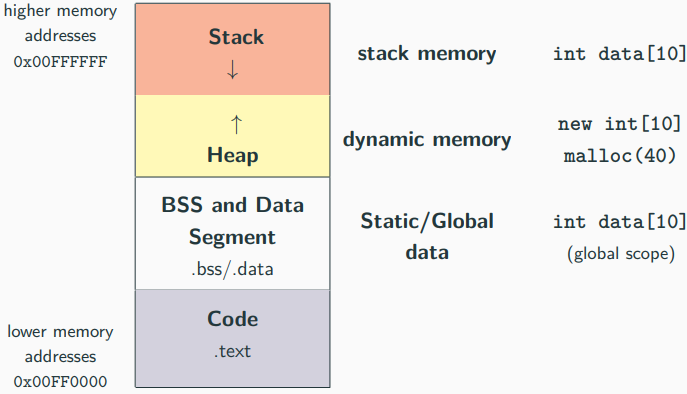
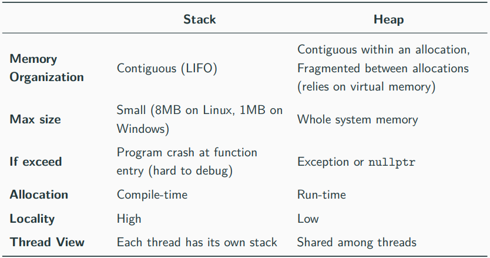

# Heap and Stack
- 프로세스 주소 공간

<br></br>
- Data and BSS(Block Started by Symbol) 세그먼트
    - 스택 메모리보다 크지만(≈ 1GB) 속도는 느림
    ```
    int data[] = {1, 2};            // DATA segment memory
    int big_data[1000000] = {};     // BSS segment memory
    // (zero-initialized)

    int main() {
        int A[] = {1, 2, 3};        // stack memory
    }
    ```
- Stack과 Heap 메모리 개요

# Stack 메모리
- 지역 변수는 Stack(이하 스택) 메모리 또는 CPU 레지스터에 있음
- 높은 성능을 가능하게 하지만 메모리 공간은 제한적임
```
int x = 3;                  // not on the stack (data segment)
struct A {
    int k;                  // depends on where the instance of A is
};

int main() {
    int y = 3;              // on stack
    char z[] = "abc";       // on stack
    A a;                    // on stack (also k)
    void* ptr = malloc(4);  // variable "ptr" is on the stack
}
```
- 스택에 저장되는 데이터 타입
    - 지역 변수
    - 함수 인수
    - 반환 값
    - 컴파일러 임시 값
    - 인터럽트 문맥
- 스택에 있는 모든 개체는 해당 개체의 범위 밖에서 접근 불가능
    ```
    int* f() {
        int array[3] = {1, 2, 3};
        return array;
    }
    
    int* ptr = f();
    cout << ptr[0];         // Illegal memory access!!
    ```
    ```
    void g(bool x) {
        const char* str = "abc";
        if (x) {
            char xyz[] = "xyz";
            str = xyz;
        }
        cout << str;        // if "x" is true, then Illegal memory access!!
    }
    ```
## 자료
- https://github.com/federico-busato/Modern-CPP-Programming/blob/master/06.Basic_Concepts_IV.pdf
