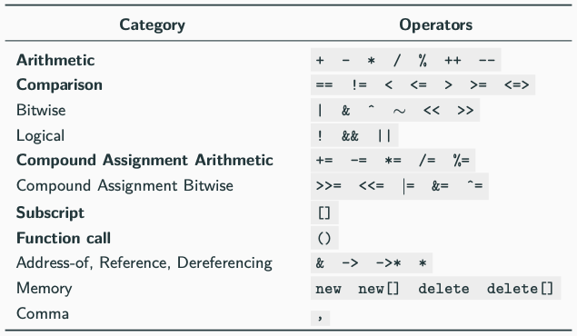

# Comparison Operator
연산자 오버로딩은 다형성의 특별한 경우로, 일부 연산자가 폴리모픽 함수처럼 취급되어 인수의 타입에 따라 다른 동작을 하는 것을 의미한다.
```cpp
struct Point {
	int x, y;
	
	Point operator+(const Point& p) const {
		return { x + p.x, y + p.y};
	}
};

Point a{1, 2};
Point b{5, 3};
Point c = a + b; // c is (6, 5)
```


오버로딩이 가능한 연산자. 특히 굵게 표시된 연산자를 많이 사용한다.
오버로딩이 불가능한 연산자는 `?, ., .*, ::, sizeof, typeof` 가 있다.

관계 및 비교 연산자 `operator<, <=, == , >= >` 는 두 객체를 비교하는 데 사용됩니다. 특히 operator< 는 객체 집합의 순서를 결정하는 데 사용된다(예: 정렬).
```cpp
#include <algorithm>
struct A {
	int x;

	bool operator<(A a) const {
		return x * x < a.x * a.x;
	}
};

A array[] = {5, -1, 4, -7};
std::sort(array, array + 4);
// array: {-1, 4, 5, -7}
```
# Spaceship Operator
C++20 allows overloading the spaceship operator `<=>` for replacing all comparison operators `operator<, <=, ==, >= >`
C++20에서는 비교 연산자 `operator<, <=, ==, >= >`를 모두 대체하는 우주선 연산자 `<=>`를 오버로딩할 수 있다.
```cpp
struct A {
	bool operator==(const A&) const;
	bool operator!=(const A&) const;
	bool operator<(const A&) const;
	bool operator<=(const A&) const;
	bool operator>(const A&) const;
	bool operator>=(const A&) const;
};

// replaced by
struct B {
	int operator<=>(const B&) const;
};
```

```cpp
#include <compare>

struct Obj {
	int x;

	auto operator<=>(const Obj& other) {
		return x - other.x;
	}
};

Obj a{3};
Obj b{5};
a < b; // true
a == b; // false
a <=> b < 0; // true
```

컴파일러는 우주선 연산자 = default를 생성할 때, 여러 필드와 배열의 기본 비교 의미론을 사용하여 코드를 생성할 수도 있다.
```cpp
#include <compare>

struct Obj {
	int x;
	char y;
	short z[2];

	auto operator<=>(const Obj&) const = default;
	// if x == other.x, then compare y
	// if y == other.y then compare z
	// if z[0] == other.z[0], then compare z[1]
}
```

우주선 연산자는 다음 중 하나의 순서를 사용할 수 있다.
- strong order
	- 만약 a가 b와 동일하다면, f(a)도 f(b)와 동일하다
	- `<, ==, >` 중 하나만 참이어야 한다.
	- 정수형 타입, 예를들어 int, char
- weak order
	- 만약 a가 b와 동일하다면, f(a)는 f(b)와 동일하지 않을 수 있다.
	- `<, ==, >` 중에 하나만 참이어야 한다.
	- 직사각형과 같은 유형, 예를들어 R{2, 5} == R{5, 2}
- partial ordering
	- 만약 a가 b와 동일하다면, f(a)가 f(b)와 동일하지 않을 수 있다.
	- `<, ==, >`가 모두 거짓일 수 있다
	- 예를들어, 부동 소수점 float 타입에서 NaN과 같은 경우이다.