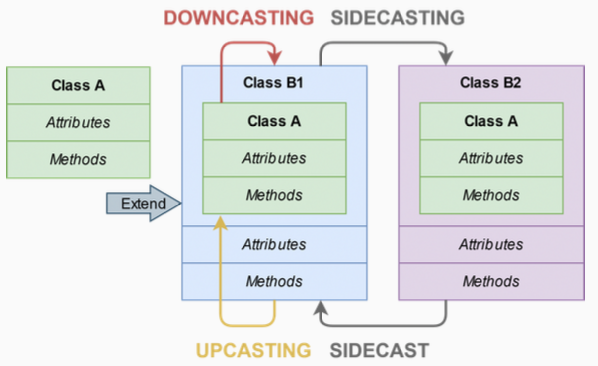

# Object-Oriented Programming II - Inheritance Casting and Run-time Type Identification

# Hierarchy Casting

Class-casting은 클래스 계층 구조내에서 한 클래스를 다른 클래스로 암시적 또는 명시적으로 변환하는것을 가능하게 한다.



- Upcasting : 파생 클래스 참조 또는 포인터를 기본 클래스로 변환하는 것
    - 암시적 또는 명시적으로 가능하다.
    - 안전하다.
    - `static_cast` 또는 `dynamic_cast`를 사용한다.
- Downcasting : 기본 클래스 참조 또는 포인터를 파생 클래스로 변환하는 것
    - 명시적으로만 가능하다.
    - 위험할 수 있다.
    - `static_cast` 또는 `dynamic_cast`를 사용한다.
- Sidecasting (or Cross-cast) : 동일한 계층 수준의 다른 클래스로 변환하는 것
    - 명시적으로만 가능하다.
    - 위험할 수 있다.
    - `dynamic_cast`를 사용한다.

```cpp
struct A {
		virtual void f() { cout << "A"; }
};

struct B : A {
		int var = 3;
		void f() override { cout << "B"; }
};

A a;
B b;
A& a1 = b; // 업캐스팅

static_cast<A&>(b).f(); // print B upcasting
static_cast<B&>(a).f(); // print A downcasting
cout << b.var; // print 3 (no cast)
cout << static_cast<B&>(a).var; // 에러 위험성이 있음!!! downcasting
```

```cpp
struct A {
		virtual void f() { cout << "A"; }
};

struct B1 : A {
		void f() override { cout << "B1"; }
};

struct B2 : A {
		void f() override { cout << "B2"; }
};

B1 b1;
B2 b2;
dynamic_cast<B2&>(b1).f(); // sidecasting, throw std::bad_cast
dynamic_cast<B1&>(b2).f(); // sidecasting, throw std::bad_cast
// static_cast<B1&>(b1).f(); // compile error
```

# Run-time Type Identification

런타임 타입 정보(RTTI, Run-Time Type Information)는 실행 시간에 객체의 타입을 결정할 수 있게 해주는 매커니즘이다.

C++에서는 RTTI를 세 가지 기능을 통해 표현한다.

- `dynamic_cast` 키워드 : 다형성 타입의 변환을 수행한다.
- `typeid` 키워드 : 객체의 정확한 타입을 식별하는데 사용된다.
- `type_info` 클래스 : `typeid`연산자가 반환하는 타입 정보 클래스이다.

RTTI는 최소 하나의 가상 메서드를 가진 다형성 클래스에만 사용할 수 있다. 이는 RTTI 기능이 가상 테이블(vtable)을 필요로 하기 때문이다.

`type_info` 클래스의 `name()`메서드는 타입의 이름을 반환한다.

```cpp
struct A {
		virtual void f() {}
};

struct B : A {};

A a;
B b;
A& a1 = b; // upcasting
cout << typeid(a).name(); // print 1A
cout << typeid(b).name(); // print 1B
cout << typeid(a1).name(); // print 1B
```

# dynamic_cast

`dynamic_cast`는 RTTI를 사용하여 출력 타입의 정확성을 추론한다. 이 작업은 런타임에 발생하며 비용이 많이 든다.

`dynamic_cast<New>(Obj)`는 다음과 같은 속성을 가진다.

- 파생 클래스 `Obj`를 기본 클래스 `New`로 반환한다. `New`와 `Obj`는 모두 포인터 또는 참조여야 한다.
- `New`와`Obj`가 참조일때 변환이 불가능하면 `std::bad_cast` 예외를 던진다.
- `New`와 `Obj`가 포인터일때변환이 불가능하면 `NULL`을 반환한다.

```cpp
struct A {
		virtual void f() { cout << "A"; }
};

struct B : A {
		void f() override { cout << "B"; }
};

A a;
B b;
dynamic_cast<A&>(b).f(); // print B upcasting

// dynamic_cast<B&>(a).f(); // throw std::bad_cast, wrong downcasting

dynamic_cast<B*>(&a); // return nullptr, wrong downcasting
```

```cpp
struct A {
		virtual void f() {cout << "A"; }
};

struct B : A {
		void f() override { cout << "B"; }
};

A* get_object(bool selectA) {
		return (selectA) ? new A(); new B();
};

void g(bool value) {
		A* a = get_object(value);
		B* b = dynamic_cast<B*>(a); // downcasting + check
		if (b != nullptr) b->f(); // executed only when it is safe
};
```
