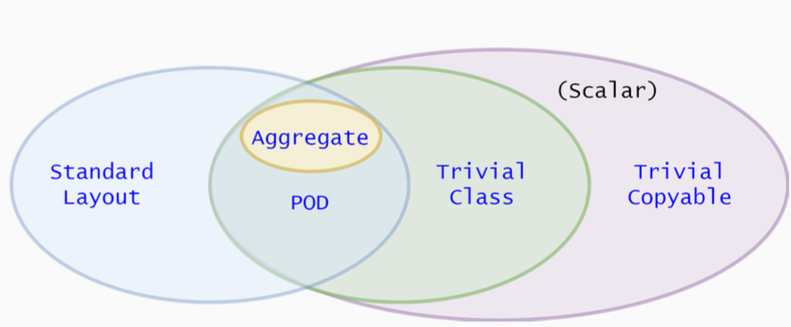

# Standard-Layout Class
---
표준 레이아웃 클래스란, 동일한 메모리 레이아웃을 갖는 C구조체나 유니온과 같은 클래스를 의미한다 (다른 언어와의 통신시 유용하다).
- 가상함수가 없어야 한다.
- 모든 비정적 멤버가 동일한 접근 제어 지시자를 가져야한다.
- 비정적 멤버 변수가 있는 기본 클래스가 없어야 한다.
- 첫 번째 비정적 멤버 변수와 같은 타입의 기본 클래스가 없어야 한다.
- 이 조건들은 재귀적으로 기본 클래스와 비정적 멤버 변수에 적용된다.

```cpp
struct StandardLayout1 {
	StandardLayout1(); // ok, user-provided constructor
	void f(); // ok, non-virtual function
};

class StandardLayout2 : StandardLayout1 {
	int x, y; // ok, both are private
	StandardLayout1 y; // ok, y is not the first data member
}

struct StandardLayout4 : StandardLayout1, StandardLayout2 {
	// ok, can use multiple inheritance as long as only
	// one class in the hierarchy has non-static data members
}
```

# Plain Old Data (POD)
---
POD는 Trivial copyable과 Standard-Layout을 합친 데이터이다.
- 사용자 제공 복사/이동/기본 생성자, 소멸자, 복사/이동 할당 연산자가 없어야 한다.
- 모든 비정적 데이터 멤버는 동일한 접근 지정자여야 한다.
- 비정적 데이터 멤버를 가진 부모클래스가 없어야 한다.
- 첫 번째 비정적 멤버 변수와 같은 타입의 기본 클래스가 없어야 한다.
- 가상 함수가 없어야 한다.
- 이 조건들은 재귀적으로 기본 클래스와 비정적 멤버 변수에 적용된다.

# Hierarchy
---
