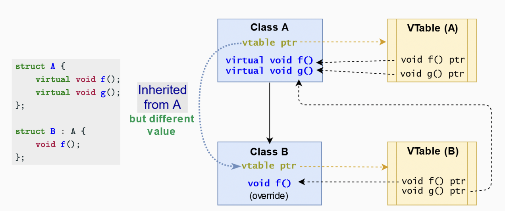

# Object-Oriented Programming II - virtual Methods | Virtual Table

# Virtual Methods

파생 클래스에서 virtual 키워드를 필수로 넣을 필요는 없지만, 가독성을 높이고 해당 함수가 가상 함수임을 사용자에게 명확히 알려준다.

## 가상 함수의 동작

```cpp
struct A {
		virtual void f() { cout << "A"; }
};

struct B : A {
		void f() { cout << "B"; }
};

void f(A& a) { a.f(); } // ok, print "B"
void g(A* a) { a->f(); } // ok, print "B"
void h(A a) { a.f(); } // 동작X. print "A"

B b;
f(b); // print "B"
g(&b); // print "B"
h(b); // print "A" (A로 형변환)
```

# Virtual Table

가상 테이블 (vtable)은 함수 호출을 해결하고 동적 디스패치(늦은 바인딩)를 지원하기 위해 사용되는 함수 조회 테이블이다.

가상 테이블에는 클래스의 객체들이 호출할 수 있는 각 가상 함수에 대한 항목이 포함되어 있다. 이 테이블의 각 항목은 단순히 해당 클래스에서 접근할 수 있는 가장 구체적인 함수를 가리키는 함수 포인터이다.

컴파일러는 해당 클래스의 가상 테이블을 가리키는 숨겨진 포인터를 기본 클래스에 추가한다(이 포인터는 sizeof 연산자로 볼 수 있다).


`virtual` 클래스는 하나의 숨겨진 포인터를 가지고 있는다.

```cpp
struct A {
		virtual void f1();
		virtual void f2();
};

class B : A {};

cout << sizeof(A); // 8 bytes (vtable pointer)
cout << sizeof(B); // 8 bytes (vtable pointer)
```
